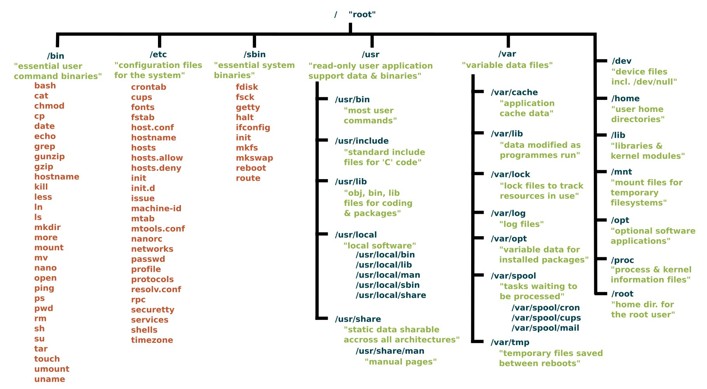
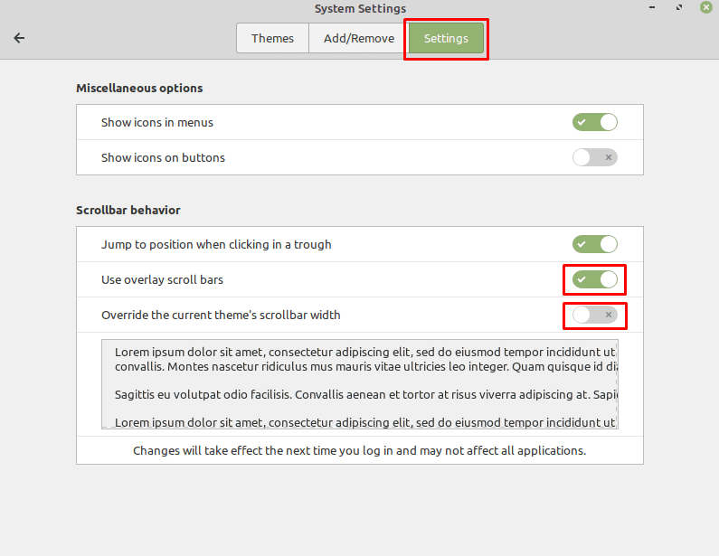
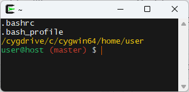

# Linux Tips

- [Linux Tips](#linux-tips)
  - [Linux version](#linux-version)
  - [grub-customizer](#Grub-Customizer)
  - [Linux file system structure](#linux-file-system-structure)
  - [Create shortcut on desktop](#create-shortcut-on-desktop)
  - [Digest](#digest)
  - [Dates](#dates)
  - [File manipulations](#file-manipulations)
  - [ssh](#ssh)
  - [StarDict + wiktionnaire](#stardict--wiktionnaire)
  - [Calibre](#calibre)
  - [wget](#wget)
  - [Time duration](#time-duration)
  - [ffmpeg](#ffmpeg)
  - [Basic calculation](#basic-calculation)
  - [Gimp](#gimp)
  - [youtube-dl](#youtube-dl)
  - [HP Printer](#hp-printer)
  - [GPG error](#gpg-error)
  - [Sublime Text](#sublime-text)
  - [Curl to test Rest API :](#curl-to-test-rest-api-)
  - [jq : json query](#jq--json-query)  
  - [Nintendo Switch Pro Controller on Linux](#Nintendo-Switch-Pro-Controller-on-Linux)
  - [cygwin tips](#cygwin-tips)

---  

## Linux version
`$ uname --all`  or  `$ cat /etc/os-release`  or `$ lsb_release -a`    

## sysinfo
`$ inxi -F`  

Memory :  
`$ dmidecode --type memory`  

## Grub-Customizer
How to change Default kernel version &rarr; [grub-customizer](https://tipsonubuntu.com/2018/03/11/install-grub-customizer-ubuntu-18-04-lts/)    
`$ sudo apt-get install grub-customizer`   

> General Settings > default entry > predifined  
> Simply select the desired kernel in the drop-down list.  

Uninstall :   
`$ sudo apt-get remove --autoremove grub-customizer`   

## Linux file system structure

[youtube](https://www.youtube.com/watch?v=HbgzrKJvDRw)  
[geeksforgeeks](https://www.geeksforgeeks.org/linux-file-hierarchy-structure/)  
  

## Create shortcut on desktop
<Ctrl+Shift> Drag/Drop on desktop  

## Browse from Computer Level
URI : `computer:///`  

## Free up disk space : remove old kernels  
$ sudo apt-get autoremove --purge  

## Uninstall 
$ apt list --installed  
$ sudo apt-get remove --purge dotnet-sdk-6.0  

## Scroll bars visible

[Make scroll bars visible](https://www.technipages.com/linux-mint-make-scroll-bars-visible/)
Themes > Settings :  
  

## Digest  

sha1sum, md5sum, etc.
`$  sha1sum file.txt | tee file.txt.sha1`  
> 362de0c3b8829da225431d40a82606808da39f68 *file.txt  

`$ sha1sum -c file.txt.sha1'  
> file.txt : OK  


## Dates

### Date format
Install missing locale if needed :  
`$ mintlocale`  
Define default time format :  
`$ echo "LC_TIME=fr_BE.UTF-8" >> $HOME/.profile`

### arithmetics  
Addition  
`$ date --date="1 month" +"%d-%m-%Y" `  
> 02-04-2023  

Substraction  
`$  date --date="15 days ago" +"%d-%m-%Y"`  
> 15-02-2023  

### Count working days (excluding WE)

`$ cal 2 2016 | tail -n +3 | cut -c 3-17 | tr ' ' '\n' | grep -v '^$' | sort -n | wc -l | head -n 1`

---
## File manipulations  

List only directories :  
`$ ls -d */`  
or  
`$ find . -type d -maxdepth 1`  

Ignore case with ls :  
`$ shopt -s nocaseglob; ls -1 *.pdf`  

Remove empty lines with sed :  
`$ sed -r '/^\s*$/d' file.txt` 

Renaming files + autonumber suffix :  
`$ rename  's/.+/our $i; sprintf("MyGallery_%03d.jpg", 1+$i++)/e' *`

Renaming files + format number :
`for file in $(ls -1 *.jpg | sort -n) ; do rename  -- 's/(\d+)/sprintf "%03d", $1/e' $file ; done`  

Counting records in csv files for given field :  
`$ for file in $(ls *.csv) ; do echo "$file $(echo `wc -l $file | cut -f1 -d';' | bc`-1 | bc)" ; done`  

Skip 1st line :  
`$ tail -n + 2 filename`

GREP : Get lines Before|After pattern   
`$ grep -B 500 'sometext' file.txt` 
`$ grep -A 500 'sometext' file.txt` 

GREP : extract substring between double quotes   
option : -o, --only-matching  
`$ grep -o '".*"' input.txt | tr -d '"' | sort -u`

Remove last character in file :  
`$ sed -i '$ s/.$//' filename`  

Surrounding "[...]" :  
`$ sed -i '1 i [' inputfile && sed -i '$ a ]' outputfile`  

Convert jdbc dates "{d 'yyyy-mm-dd'}" => 'yyyy-mm-dd' :  
`$ sed -i -E "s/\{d ('.{10}')\}/\1/g" file.sql`  

Split into smaller files :  
```
# -l : nb lines
# -d : add autonum suffix
# -a : nb of digits for suffix
$ split -l 100 input.sql "baseFileName" -d -a 3 --additional-suffix=".sql"
# append string "commit" in each file
$ for file in $(ls -1 *.sql) ; do sed -i '$ a commit;' $file ; done
# append string "--EOF" in each file
$ for file in $(ls -1 *.sql) ; do sed -i '$ a --EOF' $file ; done
```

Unwanted characters...  
`$ iconv --unicode-subst="<U+%04X>" -f utf8 -t ascii input.xsd | tee temp/charset.xsd`  
or trying to remove accents...  
`$ iconv -f utf8 -t ascii//TRANSLIT input.xsd | tee temp/iconv_translit.xsd`   

Read-Write permissions  
`$ find . * -exec chmod u+rwx {} \;`  
(cygwin : setfacl)  
`$ find . -exec setfacl -s user::rw-,group::r--,other::r-- {} \;`  

Mimic a "GROUP BY HAVING field=MAX()" using tail, sort (much faster than SQL on large tables)  
```
# sort options :
# -k : -k, --key=POS1[,POS2] 	Start a key at POS1 (origin 1), end it at POS2 
# -r --reverse
# -n, --numeric-sort
# -o, --output=FILE
# -t, --field-separator=SEP

# Example 
# Group By Having field3=Max(field3)' per distinct couples field1-field2
$ tail -n +2 input.csv | sort -k3,3r | sort -k1,1 -k2,2 -u -o output.csv

# sort -k3,3r : sort on 3th field in reverse order
# sort -k1,1 -k2,2 -u : sort uniques couples 1st-2d fields... 
# good to know : "sort" seems to keep the first occurence of the 3th field
```

---

## ssh

Activate ssh :  

```bash
$ sudo apt-get install openssh-server
$ systemctl status sshd
$ systemctl enable sshd
```
```bash
$ ssh-keygen -t rsa
[or ssh-keygen -t rsa -c user.name@gmail.com]
[...]
The key fingerprint is:
SHA256:................................. username@local_hostname
The key's randomart image is:
+---[RSA 2048]----+
|       ..  oo.   |
|      E.o  .. o  |
|       ooO.  . . |
|       .@o* . o  |
|     . +S* o +   |
|      +o+.= . o  |
|     . =.= o   o |
|    . oo.++     .|
|     +o+Oo..     |
+----[SHA256]-----+
$ ssh-copy-id -i .ssh/id_rsa.pub username@remote_hostname
```
Copy file to remote host (eg : 192.168.0.3) :  

`$ scp file.zip user@192.168.0.3:/home/user/Desktop/`  

Copy directory to remote host :   

-r : recursive, -p : preserve properties
`$ scp -r /local/directory/ user@192.168.0.3:/home/user/Desktop/`  

Check file modification date on remote :  

`$ ssh -i /cygdrive/c/cygwin64/home/username/.ssh/id_rsa username@ftpserver stat ./folder/file.xlsx | grep "Modify"`    

---

## StarDict + wiktionnaire

- Download and install StarDict (https://sourceforge.net/projects/stardict-4/files/3.0.6.2/stardict_3.0.6.2-1_all.deb/download)

stardict_3.0.6.2-1_all.deb

- [Download dictionaries] (https://github.com/BoboTiG/ebook-reader-dict/releases/tag/fr)
[wikdict.com](https://download.wikdict.com/dictionaries/)  

- Unzip and copy dict-fr into stardict folder

`$ sudo cp -r dict-fr /usr/share/stardict/dic/`


---

## Calibre

https://calibre-ebook.com/download_linux

[Download calibre 4.23.0](https://download.calibre-ebook.com/4.23.0/calibre-4.23.0-x86_64.txz)

install calibre tarball

```
$ sudo mkdir -p /opt/calibre && \  
rm -rf /opt/calibre/* && \  
sudo tar xvf /home/jinx/Downloads/calibre/calibre-4.23.0-x86_64.txz -C /opt/calibre && \  
sudo /opt/calibre/calibre_postinstall
```

[Download and unzip DeDRM_tools 6.8.1](including Obok plugin)](ttps://github.com/apprenticeharper/DeDRM_tools/releases/download/v6.8.1/DeDRM_tools_6.8.1.zip)  
[Fork](https://github.com/noDRM/DeDRM_tools)  
Load plugin DeDRM in Calibre

> menu > preferences > advanced > plugins 


---

## wget 

Leech an entire web site

     --recursive: download the entire Web site.  
     --domains website.org: do not follow links outside website.org.  
     --no-parent: do not follow links outside the directory tutorials/html/.  
     --page-requisites: get all the elements that compose the page (images, CSS and so on).  
     --html-extension: save files with the .html extension.  
     --convert-links: convert links so that they work locally, off-line.  
     --restrict-file-names=windows: modify filenames so that they will work in Windows as well.  
     --no-clobber: do not overwrite any existing files (used in case the download is interrupted and resumed).  

```
$ wget \
     --recursive \
     --page-requisites \
     --html-extension \
     --convert-links \
     --restrict-file-names=windows \
     --domains example.com \
     --wait=3 \
     --no-parent \
	https://www.example.com/index.html
```
one-line :  
`$ wget --recursive --page-requisites --html-extension --convert-links --restrict-file-names=windows --domains example.com --wait=3 --no-parent  https://www.example.com/index.html`  


Basic authentication :  
`$ wget --user=username --password=superpasswd http://target-url`  

---

## Time duration
```
START=$(date +%s -d 05:36:11)
END=$(date +%s -d 06:46:00) 
DURATION_SECONDS=$(expr $END - $START)
date +%H:%M:%S -ud @$DURATION_SECONDS
```
	Output : 01:09:49

oneline  

`date +%H:%M:%S -ud $(echo @$(expr $(date +%s -d 06:46:00) - $(date +%s -d 05:36:11)))` 


## ffmpeg

- Cut Sample Video (Fast)

38:43 : start  
04:26 : duration  
43:09 : end  

`$ ffmpeg -ss 00:38:43 -t 00:04:26 -i "input.avi" -acodec copy -vcodec copy sample.avi`

- VOB to mp4 (DVD lossless) 
`$ ffmpeg -i input.VOB -c:v copy -c:a copy output.mp4`   

- mp4 to gif

`$ ffmpeg -i input.mp4 -vf "fps=10,scale=320:-1:flags=lanczos" -c:v pam -f image2pipe - | convert -delay 10 - -loop 0 -layers optimize output.gif]` 

- [Screen recording](https://www.wikihow.com/Record-Your-Desktop-Using-FFmpeg-on-Ubuntu-Linux)

	no sound[^screen_size]  
`$ ffmpeg -video_size 1920x1080 -framerate 30 -f x11grab -i :0.0+0,0 -c:v libx264rgb -crf 30 -preset ultrafast sample.mkv`  

	with sound[^ffmpeg_params]  
`$ ffmpeg -video_size 1920x1080 -framerate 30 -f x11grab -i :0.0+0,0 -f pulse -filter_complex amerge -ac 2 -i 0 -f pulse -ac 2 -i 1 -c:v libx264rgb -crf 0 -preset ultrafast sample.mp4`  

[^screen_size]:
	Find out screen size : `$ xdpyinfo | grep dimensions` 

[^ffmpeg_params]:
	**-video_size**
	    specifies the size of the recorded area. 
	    If you have a different screen size, use that instead of 1920x1080. 
	    If you want to record only an area of the screen, specify the area size here.

	**-framerate** 
	    specifies the frame rate, i. e. how many frames of video are recorded in a second. 
	    If you need another frame rate, use another number than 30. 
	    The lowest allowed framerate is 20.

	**-f x11grab** 
	    is what actually tells FFmpeg to record your screen. You shouldn't change that.

	**-i :0.0+0,0** 
	    is where you specify the x and y offset of the top left corner of the area that you want to record. 
	    For example, use :0.0+100,200 to have an x offset of 100 and an y offset of 200.

	**-c:v libx264rgb -crf 0 -preset ultrafast**
	    are encoding options. These specify a fast and lossless recording.

	 **-f pulse** 
	    tells FFmpeg to grab the input from PulseAudio, which is your sound server.

	**-ac 2** 
	    specifies the number of audio channels. 
	    If you receive an error like: "cannot set channel count to 2 (Invalid argument)",
	    you should change that to 1.

	**-i 0** 
	    specifies which device to grab the input from. 
	    You can see a list of all devices with the command `pacmd list-sources`. 
	    The number behind -i is the index listed there. 
	    The other output of the command will give you an explanation of what that audio device is for. 
	    A device with a name like "Monitor of Built-in Audio Analog" will most likely record the system audio, 
	    while something with "microphone" in the description will most likely be a microphone.  

Cygwin + microphone (first : enable "Stereo Mix" mmsys.cpl)  

`$ ffmpeg -list_devices true -f dshow -i dummy` 

`$ ffmpeg -f gdigrab -s 1920x1080 -i desktop -f dshow -i audio="Microphone Array (Realtek(R) Audio)" -crf 28  -filter:a "volume=1.5" -vcodec libx264 output.mp4`  

---

## Basic calculation  

`$ echo "2^10" | bc`

---

## Gimp

[Launch Gimp in French](https://docs.gimp.org/en/gimp-fire-up.html#gimp-concepts-running-language)  

`$ LANGUAGE=fr gimp` 

---

## youtube-dl

`$ sudo apt-get install youtube-dl`  
`$ sudo apt-get install python3-pip python-dev`  


---

## HP Printer

`$ sudo hp-setup -i`

---

## GPG error

`$ sudo apt-get update`

"GPG error: http://dl.google.com stable Release: The following signatures couldn't be verified because the public key is not available: NO_PUBKEY 78BD65473CB3BD13"

`$ wget -q -O - https://dl.google.com/linux/linux_signing_key.pub | sudo apt-key add -`

---

## Sublime Text

[Get rid of nag screen](https://gist.github.com/tonkoandrew/6da28ad58ee2a0371f8019142fb898c1)

`$ cp remover.py ~/.config/sublime-text/Packages/User/`

Reformat/Reindent Code  

CTRL+SHIFT+P : to open Command palette  
S, S, J : Enter selected Java as current syntax  
CTRL+A : to select all code  
CTRL+SHIFT+P : to open Command palette again  
r, e, i, n, ENTER : to issue the reindent command


## Curl to test Rest API :  
```
$ curl -X POST -H "Content-Type:application/json" --data @example.json http://localhost:8080/rest/app/1/add 
{"field1":"1","field2":"2"}
```
## jq : json query 

Filter output for selected fields :  
`$ jq -r '[ .[] | {id: .id, field1: .field1} ]' file.json `  

Filter array by range :  
`$ jq -r '[ .[293:296] | .[] | {id: .id, field1: .field1} ]' file.json`  

Export to csv (problem if order of columns matters) :  

`$ jq -r -f filter.jq file.json > out.csv`  

```
 filter.jq :
def tocsv:
    (map(keys)
        |add
        |unique
    ) as $cols
    |map(. as $row
        |$cols
        |map($row[.]|tostring)
    ) as $rows
    |$cols,$rows[]
    | @csv;
tocsv
```
or (one-line)  
`$ jq 'map(. | .id, .field1, .field2 | tostring) | @csv' input.json > output.csv`  

`$ jq -r '.[] | [.field1, .field2, .field3] | @csv' input.json > output.csv`  

some arithmetic on fields :  
`$ jq -r '.[] | [.field1, .field2, (.fieldX | tonumber)+(.fieldY | tonumber)] | @csv ' input.json > output.csv`  

---  
## keyboard

	*xev* : Press any key to identify the corresponding Keycode  

`$ xev | awk -F'[ )]+' '/^KeyPress/ { a[NR+2] } NR in a { printf "%-3s %s\n", $5, $8 }'`

	*xdotool* : Emulate key stroke

`$ xdotool key 5`  

	*xkeycaps* : graphically display and edit the X keyboard mapping

	*Xbindkeys* : to bind commands to certain keys or key combinations on the keyboard.
---

## Nintendo Switch Pro Controller on Linux 

`$ sudo nano /etc/udev/rules.d/60-steam-input.rules`  

```
# Nintendo Switch Pro Controller over USB hidraw
KERNEL=="hidraw*", ATTRS{idVendor}=="057e", ATTRS{idProduct}=="2009", MODE="0660", TAG+="uaccess"
# Nintendo Switch Pro Controller over bluetooth hidraw
KERNEL=="hidraw*", KERNELS=="*057E:2009*", MODE="0660", TAG+="uaccess"
```
Go to Bluetooth device manager ;-)  

---

## cygwin tips 

### Call bash script from cmd :

```cmd
@echo off
@%~d0
@cd %~p0
@C:\cygwin64\bin\bash -c ./my_script.sh
```

### Cygwin in contextual menu  
install **chere** package under the "Shells" category.
```
chere
-i : install  
-t : terminal  
-a : all users  
-e : contextual text  
-s : shell  
-p : print regtool commands to stdout rather than running them   
```
(as admin) `$ chere -i -e "Cygwin from here" -t mintty -s bash`  

cf new entry in contextual menu :   
> "&Cygwin from here" 

Customize contextual menu using registry 
> Modify contextual text (admin rights not needed):  

```bash
regtool -w -s set /HKCU/Software/Classes/Drive/Shell/cygwin64_bash '&Cygwin from here'
regtool -w -s set /HKCU/Software/Classes/Drive/Shell/cygwin64_bash/command 'C:\cygwin64\bin\mintty.exe -e /bin/xhere /bin/bash.exe "%V"'
regtool -w -s set /HKCU/Software/Classes/Drive/Shell/cygwin64_bash/Icon 'C:\cygwin64\Cygwin-Terminal.ico'
regtool -w -s set /HKCU/Software/Classes/Drive/Background/Shell/cygwin64_bash/command 'C:\cygwin64\bin\mintty.exe -e /bin/xhere /bin/bash.exe "%V"'
regtool -w -s set /HKCU/Software/Classes/Drive/Background/Shell/cygwin64_bash/Icon 'C:\cygwin64\Cygwin-Terminal.ico'

regtool -w -s set /HKCU/Software/Classes/Directory/Shell/cygwin64_bash '&Cygwin from here'
regtool -w -s set /HKCU/Software/Classes/Directory/Shell/cygwin64_bash/command 'C:\cygwin64\bin\mintty.exe -e /bin/xhere /bin/bash.exe "%V"'
regtool -w -s set /HKCU/Software/Classes/Directory/Shell/cygwin64_bash/Icon 'C:\cygwin64\Cygwin-Terminal.ico'
regtool -w -s set /HKCU/Software/Classes/Directory/Background/Shell/cygwin64_bash/command 'C:\cygwin64\bin\mintty.exe -e /bin/xhere /bin/bash.exe "%V"'
regtool -w -s set /HKCU/Software/Classes/Directory/Background/Shell/cygwin64_bash/Icon 'C:\cygwin64\Cygwin-Terminal.ico'

# You can remove them with this:
regtool -w unset /HKCU/Software/Classes/Drive/Shell/cygwin64_bash/Icon
regtool -w unset /HKCU/Software/Classes/Drive/Background/Shell/cygwin64_bash/Icon
[...]
```
### Copy Paste issue

"\302\203": copy-to-clipboard  
"\302\226": paste-from-clipboard

Add the following line to your ~/.bashrc:

	stty lnext ^q stop undef start undef

And add the following line to your ~/.inputrc:

	"\C-v": paste-from-clipboard
[Infos](https://www.saltycrane.com/blog/2008/05/how-to-paste-in-cygwin-bash-using-ctrl/)  

### Customize cygwin prompt

Edit .bashrc to define PS1 variable :   
```bash
# function to detect git repository
parse_git_branch() {
   git branch 2> /dev/null | sed -e '/^[^*]/d' -e 's/* \(.*\)/ (\1)/'
}
# Combine path + newline + git branch (if repository is present) + Customize colors...
# \[\e[1;33m\]\w\n	— current working directory in yellow + newline
# \[\e[32m\]\u@\h	— user and host in green
# \e[0;31m$(parse_git_branch)\[\033[37m\]	— git branch name in red + following in grey
export PS1="\[\e[1;33m\]\w\n\[\e[1;36m\]\[\e[0m\]\[\e]0;\w\a\]\[\e[32m\]\u@\h\e[0;31m$(parse_git_branch)\[\033[37m\] $ "     
```
Reload .bashrc  
`$ source ~/.bashrc` 

  

### Keyboard shortcuts  
Alt + b : backward previous word  
Alt + f : forward  next word  
/cygdrive/c/  
/cygdrive/d/  

### cygpath
cygpath -w <PATH> : windows like path  
```
$ cd /cygdrive/c/Windows/Temp
$ cygpath -w $(pwd)
C:\Windows\Temp
```
cygpath -u <PATH> : unix like path  
`$ cd "$(cygpath -u 'C:\Program Files\')"`  

### find : Permission denied
*find . -iname* : [get rid of polluting "Permission denied"](https://unix.stackexchange.com/questions/42841/how-to-skip-permission-denied-errors-when-running-find-in-linux#answer-42842)  

```bash
$ cd /cygdrive/c
$ find . -iname "filename" 2>&1 | grep -v "Permission denied"
```
### ls : ignore case 
*ls* : how to ignore case :  
use shell options [shopts](https://www.cyberciti.biz/faq/ls-command-case-insensitive-mode-search-pattern-linux-unix/)  
`$ shopt -s nocaseglob ` -s : set ignore case  
`$ ls *.txt`  
`$ shopt -u nocaseglob ` -u : unset ignore case   

### Files names containing spaces
Tackle Loop File Names with spaces : **IFS** (Internal Field Separator) :	
```bash
IFS_BAK=$IFS
IFS=$'\n'
for file in $(ls -1 Files/*.{pdf,PDF}) ;
do
   exiftool -Author -Creator -Title $file 
done
IFS=$IFSBAK	
```	
### /dev/null 
Cygwin /dev/null equivalent :  
`$ wget http://download.thinkbroadband.com/1GB.zip -O NUL` 
```
db2 => connect to SAMPLE user username using password
db2 => load from c:\temp\csv\NUL of del replace into SCHEMA1.TABLE1 nonrecoverable
```

check db2_2.log Investigate wich columns are set to null : 
```
$ grep column db2.log | sed -e 's/.*column /column /;s/ cannot.*//' | sort -u
column 12  FIELD12
column 13  FIELD13
# these columns are ignored (null) - they are useless 
```
